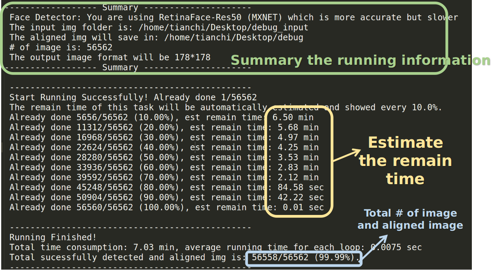

## Function: This is to process the face data to meet the standard format - 218*178 or 178*178 for Video Structuring - face attributes part.

## More choices

1. You can choose the RetinaFace detector based on pytorch or mxnet
2. the output can be choosed as '218*178' or '178*178'
3. More details can be found in config.py

## Easy to use

Input only need the path of the folder of images and the path to save.
And it will automatically process the img in your folder and estimate the remain time.

## How to use

Download model from: https://drive.google.com/file/d/1p5y5mda2AY7-hEuE56E0jeqgfBwiaZWz/view?usp=sharing
And put into RetinaFace_Detector/model/
Run 'bash run.sh' to run this repo.

## Example

